# Class Diagram — Sistem Absensi Wajah dengan Liveness Detection

> Skripsi — Enrico Kevin Ariantho (NIM 0806022210012)
> STIE Ciputra Makassar

## Diagram Mermaid

```mermaid
classDiagram
    %% ============================================================
    %% CORE INFERENCE LAYER (Pipeline Biometrik)
    %% ============================================================

    class AttendanceSystem {
        -FaceDetector detector
        -FaceRecognizer recognizer
        -LivenessDetector liveness
        -AntiSpoofingDetector anti_spoofing
        -dict cooldown
        +__init__()
        +reload_templates()
        +is_cooldown(id_karyawan) bool
        +process_frame(frame, faces) list
        +run(stop_event) bool
    }

    class FaceDetector {
        -YOLO model
        -float confidence
        -str device
        +__init__()
        +detect(frame) list
        +draw_faces(frame, faces) ndarray
    }

    class FaceRecognizer {
        -FaceAnalysis app
        -float threshold
        +__init__()
        +get_embedding(frame, bbox, faces_insightface) ndarray
        +cosine_similarity(emb1, emb2) float
        +identify(embedding, templates) dict
    }

    class LivenessDetector {
        -float ear_threshold
        -int ear_consec_frames
        -int head_move_threshold
        -int liveness_window
        -int calibration_frames
        -float blink_drop_ratio
        -dict states
        +__init__()
        -_get_state(track_id) dict
        +reset_state(track_id)
        +calculate_ear_bbox(eye_landmarks) float
        +check_liveness(track_id, face_obj) tuple
    }

    class AntiSpoofingDetector {
        -torch.device device
        -list models
        +__init__(model_dir)
        +crop_face(frame, bbox, scale) ndarray
        +predict(frame, bbox) tuple
    }

    class MiniFASNet {
        <<abstract>>
        +forward(x) Tensor
    }

    class MiniFASNetV1 {
        +forward(x) Tensor
    }

    class MiniFASNetV2 {
        +forward(x) Tensor
    }

    class MiniFASNetV1SE {
        +forward(x) Tensor
    }

    class MiniFASNetV2SE {
        +forward(x) Tensor
    }

    %% ============================================================
    %% UI LAYER (CustomTkinter SaaS Dashboard)
    %% ============================================================

    class DashboardApp {
        -CTk root
        -dict pages
        -str current_name
        -dict nav_buttons
        -int _last_camera_index
        -bool _auto_refresh_paused
        +__init__(root)
        +show_page(name)
        +start_daemon()
        +stop_daemon()
        -_is_daemon_running() bool
        -_tick_auto_refresh()
        -_create_page(name) CTkFrame
    }

    class HomePage {
        -DashboardApp app
        -dict card_karyawan
        -dict card_today
        -dict card_terlambat
        -dict card_cepat
        -ttk.Treeview tree
        -CTkButton btn_attendance
        +__init__(parent, app)
        +refresh()
        +on_show()
        -_on_toggle_attendance()
    }

    class KaryawanListFrame {
        -DashboardApp app
        -ttk.Treeview tree
        -CTkLabel stats_label
        +__init__(parent, app)
        +refresh()
        +on_show()
        -_load_data()
        -_on_add_karyawan()
        -_on_delete()
    }

    class LogAbsensiFrame {
        -DashboardApp app
        -CTkTabview tabview
        -ttk.Treeview h_tree
        -ttk.Treeview l_tree
        -list karyawan_list
        +__init__(parent, app)
        +refresh()
        +on_show()
        -_load_harian_data()
        -_load_lewatan_data()
        -_on_export_csv()
        -_run_lazy_resolve()
    }

    class EnrollmentWindow {
        -CTkToplevel window
        -StringVar nip_var
        -StringVar nama_var
        -StringVar jabatan_var
        -StringVar jenis_var
        +__init__(parent)
        -_validate_form() dict
        -_on_next()
    }

    class UploadEnrollmentWindow {
        -CTkToplevel window
        -dict karyawan_data
        -list slots
        -list preview_imgs
        -FaceDetector detector
        -FaceRecognizer recognizer
        +__init__(parent, karyawan_data, on_complete)
        -_on_pick_file(idx)
        -_show_preview(idx, frame, faces, failed)
        -_on_save()
        -_on_cancel()
    }

    class CameraPickerDialog {
        -CTkToplevel window
        -int default_index
        -int selected_index
        -list cameras
        -subprocess.Popen _preview_proc
        +ask(parent, default_index)$ int
        +__init__(parent, default_index)
        -_on_confirm()
        -_on_cancel()
        -_on_preview()
        -_kill_preview_proc()
    }

    %% ============================================================
    %% UTILITY / DATA LAYER
    %% ============================================================

    class camera_detector {
        <<module>>
        +list_cameras(max_index) list
    }

    class onnx_patch {
        <<module>>
        -bool _patched
        +apply()
        -_patched_init(self, ...)
    }

    class db_operations {
        <<module>>
        +get_all_karyawan() list
        +get_karyawan_by_id(id) dict
        +delete_karyawan(id) bool
        +get_all_templates() list
        +save_karyawan(nip, nama, jabatan, jenis) int
        +save_template(id, embedding, versi) bool
        +save_karyawan_with_template(...) int
        +save_log_absensi(id, jenis_event, conf, liveness) bool
        +get_log_absensi(filter_date, filter_karyawan, filter_event, limit) list
        +get_log_stats() dict
        +resolve_attendance_for_date(tanggal) int
        +resolve_pending(until_date) dict
        +get_absensi_harian(filter_date, ..., filter_status, limit) list
        +get_absensi_harian_stats(filter_date) dict
        +predict_today_absensi(now) list
    }

    class payload {
        <<module>>
        +build_payload(id, nama, jenis, conf, liveness) dict
        +send_payload(payload)
    }

    class attendance_daemon {
        <<entry-point>>
        +run_daemon()
        +setup_logging()
    }

    class midnight_resolve {
        <<entry-point>>
        +main()
    }

    %% ============================================================
    %% RELATIONSHIPS
    %% ============================================================

    %% Composition: AttendanceSystem uses pipeline components
    AttendanceSystem *-- FaceDetector
    AttendanceSystem *-- FaceRecognizer
    AttendanceSystem *-- LivenessDetector
    AttendanceSystem *-- AntiSpoofingDetector

    %% Inheritance: MiniFASNet variants
    MiniFASNet <|-- MiniFASNetV1
    MiniFASNet <|-- MiniFASNetV2
    MiniFASNet <|-- MiniFASNetV1SE
    MiniFASNet <|-- MiniFASNetV2SE
    AntiSpoofingDetector o-- MiniFASNet : ensemble

    %% UI: DashboardApp aggregates pages
    DashboardApp o-- HomePage
    DashboardApp o-- KaryawanListFrame
    DashboardApp o-- LogAbsensiFrame

    %% UI: page → dialog
    KaryawanListFrame ..> EnrollmentWindow : opens
    EnrollmentWindow ..> UploadEnrollmentWindow : opens
    HomePage ..> CameraPickerDialog : opens
    DashboardApp ..> CameraPickerDialog : opens

    %% UploadEnrollment pakai face detection + recognition (untuk validate foto)
    UploadEnrollmentWindow ..> FaceDetector : uses
    UploadEnrollmentWindow ..> FaceRecognizer : uses

    %% UI menggunakan camera_detector untuk enumerate cameras
    CameraPickerDialog ..> camera_detector : uses

    %% Inference pipeline pakai ONNX patch (auto-applied)
    FaceRecognizer ..> onnx_patch : applies patch before insightface

    %% Database access dari berbagai layer
    AttendanceSystem ..> db_operations : save_log_absensi, get_all_templates
    UploadEnrollmentWindow ..> db_operations : save_karyawan_with_template
    KaryawanListFrame ..> db_operations : get_all_karyawan, delete_karyawan
    HomePage ..> db_operations : predict_today_absensi, get_absensi_harian_stats
    LogAbsensiFrame ..> db_operations : get_absensi_harian, get_log_absensi, resolve_pending

    %% Payload integration
    AttendanceSystem ..> payload : build & send

    %% Daemon spawn AttendanceSystem
    attendance_daemon ..> AttendanceSystem : spawns subprocess (main.py)
    midnight_resolve ..> db_operations : resolve_attendance_for_date
```



---

## Penjelasan Komponen

### 1. Core Inference Layer (Pipeline Biometrik)

| Class | Tanggung Jawab |
|---|---|
| `AttendanceSystem` | Orkestrator pipeline absensi: YOLO → ArcFace → Liveness Stage 1 → Stage 2 → Log |
| `FaceDetector` | Deteksi wajah pakai YOLO26n custom-trained |
| `FaceRecognizer` | Pengenalan identitas via InsightFace ArcFace (buffalo_l) |
| `LivenessDetector` | Liveness Stage 1: EAR adaptive + head movement |
| `AntiSpoofingDetector` | Liveness Stage 2: ensemble MiniFASNet (V2 + V1SE) |
| `MiniFASNet` (4 varian) | Arsitektur CNN dari Silent-Face-Anti-Spoofing |

### 2. UI Layer (CustomTkinter SaaS Dashboard)

| Class | Tanggung Jawab |
|---|---|
| `DashboardApp` | Single-window dashboard dengan sidebar + content area |
| `HomePage` | Page utama: stat cards + tabel prediksi absensi hari ini |
| `KaryawanListFrame` | CRUD karyawan + tombol Tambah Karyawan |
| `LogAbsensiFrame` | 2 tab: Absensi Harian + Raw Lewatan + filter + export CSV |
| `EnrollmentWindow` | Form NIP, Nama, Jabatan (modal Toplevel) |
| `UploadEnrollmentWindow` | Upload 3 foto + face detect + save (modal Toplevel) |
| `CameraPickerDialog` | Modal pilih kamera dengan tombol Preview |

### 3. Utility & Data Layer

| Module | Tanggung Jawab |
|---|---|
| `camera_detector` | Enumerate kamera available via OpenCV |
| `onnx_patch` | Monkey-patch ONNX SessionOptions untuk disable arena memory pool |
| `db_operations` | CRUD karyawan, template_wajah, log_absensi, absensi_harian, resolver tengah malam |
| `payload` | Build JSON payload untuk integrasi backend HRIS (stub) |
| `attendance_daemon` | Entry-point auto-restart loop untuk mode 24 jam |
| `midnight_resolve` | Entry-point batch job resolver (dipanggil launchd) |

---

## Hubungan Antar Class

### Composition (kuat — class punya instance ini langsung)
- `AttendanceSystem` *-- `FaceDetector`, `FaceRecognizer`, `LivenessDetector`, `AntiSpoofingDetector`

### Inheritance
- `MiniFASNet` <|-- `MiniFASNetV1`, `MiniFASNetV2`, `MiniFASNetV1SE`, `MiniFASNetV2SE`

### Aggregation (lemah — class manage tapi tidak own)
- `DashboardApp` o-- `HomePage`, `KaryawanListFrame`, `LogAbsensiFrame`
- `AntiSpoofingDetector` o-- `MiniFASNet` (ensemble multiple variants)

### Dependency (menggunakan, bukan composition)
- `UploadEnrollmentWindow` ..> `FaceDetector`, `FaceRecognizer` (validate foto saat upload)
- Semua UI class ..> `db_operations` (CRUD database)
- `AttendanceSystem` ..> `payload` (build + send payload)

---

## Konteks Tech Stack

```
┌─────────────────────────────────────────────────────────────────┐
│                   PYTHON 3.11 RUNTIME                            │
└─────────────────────────────────────────────────────────────────┘
                              │
        ┌─────────────────────┴─────────────────────┐
        ▼                                            ▼
┌────────────────────┐                  ┌──────────────────────┐
│  INFERENCE LAYER   │                  │     UI LAYER         │
│                    │                  │                      │
│  Ultralytics       │                  │  CustomTkinter 5.2   │
│  (YOLO 8.4.33)     │                  │  Tkinter (built-in)  │
│                    │                  │  Pillow              │
│  InsightFace 0.7.3 │                  └──────────────────────┘
│  ONNX Runtime      │
│  (buffalo_l)       │                  ┌──────────────────────┐
│                    │                  │   DATA LAYER         │
│  PyTorch 2.11      │                  │                      │
│  (MiniFASNet)      │                  │  psycopg2-binary     │
│                    │                  │  PostgreSQL 18       │
│  OpenCV 4.13       │                  │                      │
│  NumPy 2.4         │                  └──────────────────────┘
└────────────────────┘
```

---

## Multi-Process Architecture

Sistem terbagi menjadi 3 proses Python independen yang berkomunikasi via database:

```
┌──────────────────────────────────────────────────────────────┐
│ PROSES 1: ui_app.py (UI Dashboard)                            │
│  - DashboardApp + 3 pages                                     │
│  - Membuka enrollment & camera picker (modal)                 │
│  - Spawn detached subprocess attendance_daemon                │
└──────────────────────────────────────────────────────────────┘
                              │
                              │ spawns
                              ▼
┌──────────────────────────────────────────────────────────────┐
│ PROSES 2: scripts/attendance_daemon.py (Auto-Restart Wrapper) │
│  - Loop spawn main.py                                         │
│  - Cek exit code (0=stop, 2=preemptive restart, else=crash)   │
│  - Pidfile guard untuk cegah double-instance                  │
└──────────────────────────────────────────────────────────────┘
                              │
                              │ spawns
                              ▼
┌──────────────────────────────────────────────────────────────┐
│ PROSES 3: main.py → AttendanceSystem (Pipeline Inference)     │
│  - Load model: YOLO + InsightFace + MiniFASNet                │
│  - Capture kamera, jalankan pipeline                          │
│  - Save log ke PostgreSQL                                     │
└──────────────────────────────────────────────────────────────┘
                              │
                              ▼
┌──────────────────────────────────────────────────────────────┐
│ POSTGRESQL: absensi_face                                      │
│  - karyawan, template_wajah, log_absensi                      │
│  - absensi_harian, resolve_log                                │
└──────────────────────────────────────────────────────────────┘
```

Plus job batch yang jalan independen (dipicu launchd 00:05 setiap hari):

```
launchd → scripts/midnight_resolve.py → resolve_attendance_for_date()
```
