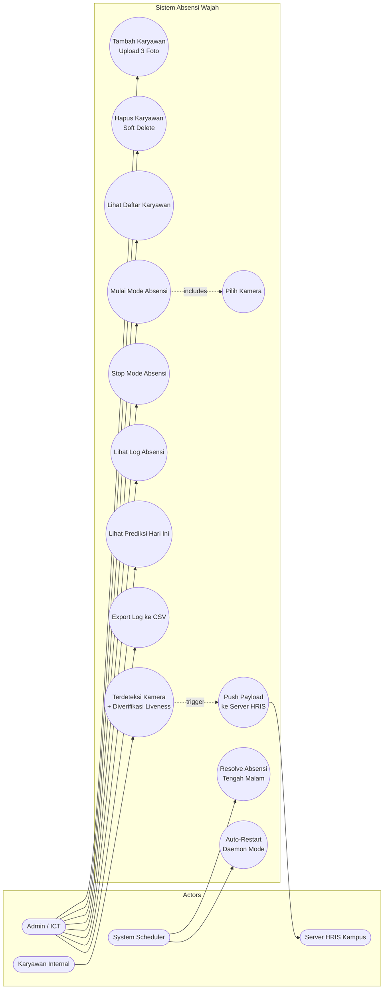
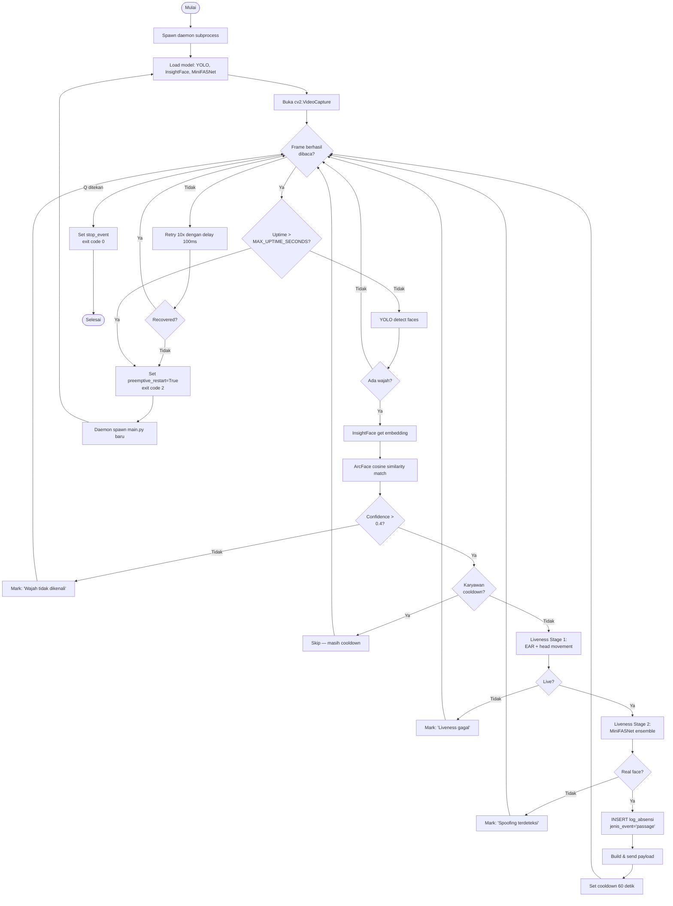
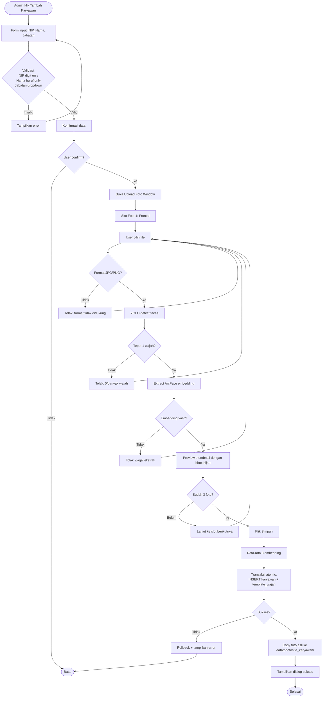
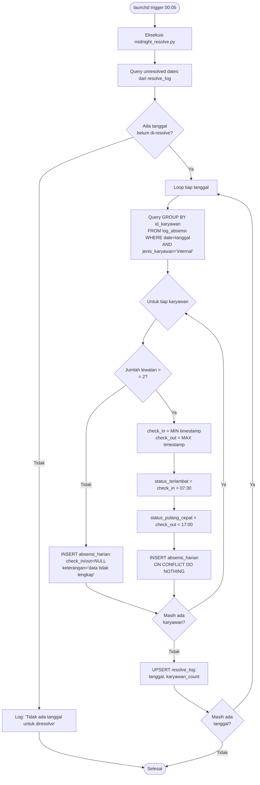
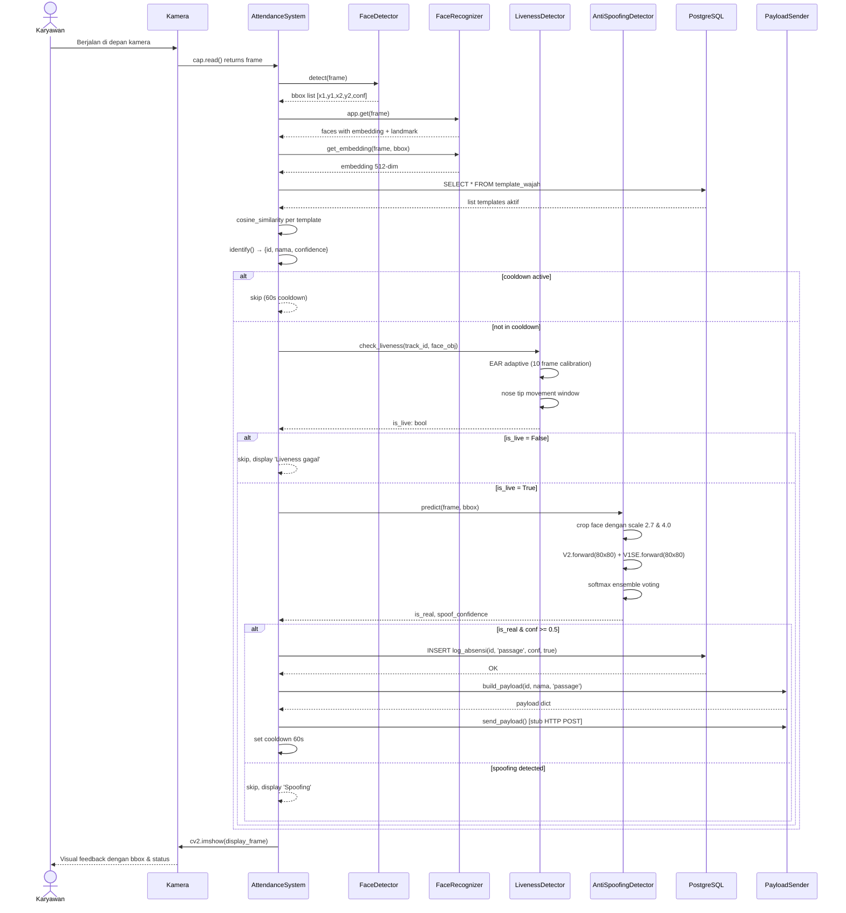
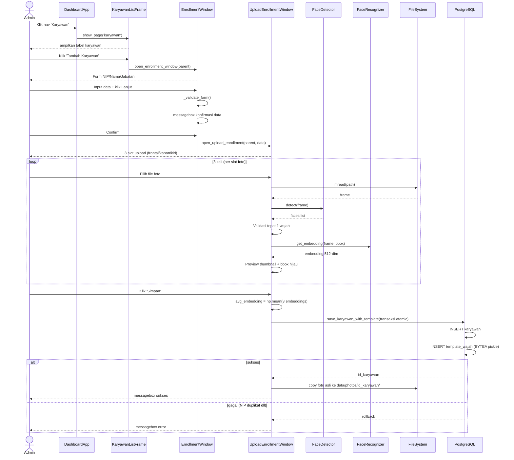
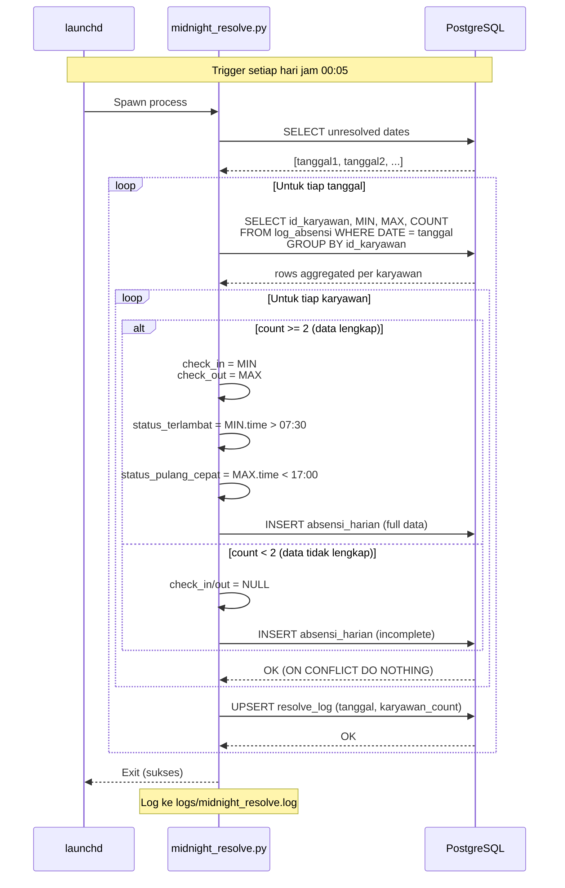
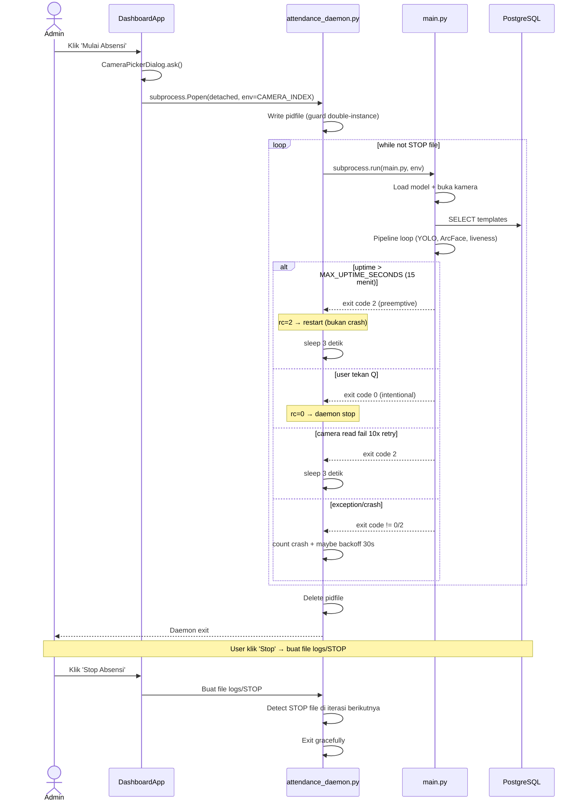
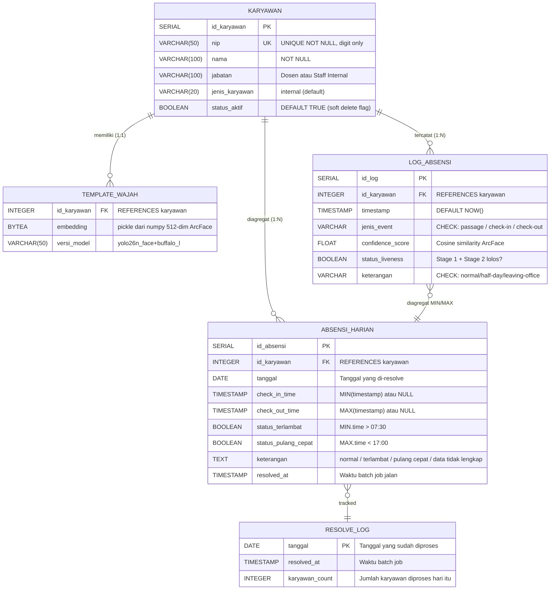

# Diagram-Diagram BAB III — Sistem Absensi Wajah

> Skripsi — Enrico Kevin Ariantho (NIM 0806022210012)
> STIE Ciputra Makassar

---

## 3.3.1.1 Use Case Diagram



### Tabel Skenario Use Case

| ID | Nama Use Case | Aktor | Deskripsi Singkat |
|---|---|---|---|
| UC1 | Tambah Karyawan | Admin/ICT | Daftarkan karyawan baru dengan upload 3 foto studio (frontal, kanan, kiri), embedding ArcFace di-extract & disimpan |
| UC2 | Hapus Karyawan | Admin/ICT | Soft delete karyawan (status_aktif=FALSE) + hard delete template_wajah |
| UC3 | Lihat Daftar Karyawan | Admin/ICT | Tampilkan tabel karyawan internal terdaftar |
| UC4 | Mulai Mode Absensi | Admin/ICT | Spawn daemon attendance subprocess + buka kamera real-time |
| UC5 | Stop Mode Absensi | Admin/ICT | Kirim sinyal STOP ke daemon untuk graceful shutdown |
| UC6 | Pilih Kamera | Admin/ICT | Modal dialog pilih kamera available + tombol Preview |
| UC7 | Lihat Log Absensi | Admin/ICT | 2 tab: Absensi Harian (resolved) + Raw Lewatan (passage mentah) |
| UC8 | Lihat Prediksi Hari Ini | Admin/ICT | Live preview hasil resolver berdasarkan lewatan kamera sampai sekarang |
| UC9 | Export Log ke CSV | Admin/ICT | Download tabel log dalam format CSV |
| UC10 | Resolve Absensi Tengah Malam | System (launchd) | Batch job harian 00:05 — agregat MIN/MAX timestamp jadi check-in/check-out |
| UC11 | Auto-Restart Daemon | System (daemon) | Wrapper attendance_daemon.py respawn main.py kalau crash atau uptime > 15 menit |
| UC12 | Terdeteksi Kamera | Karyawan (pasif) | Karyawan lewat → YOLO detect → ArcFace match → liveness verify → log passage |
| UC13 | Push Payload ke HRIS | System | Build JSON payload + kirim HTTP POST ke server kampus (stub) |

---

## 3.3.1.2 Activity Diagram

### A. Aktivitas Mode Absensi Real-Time



### B. Aktivitas Enrollment Karyawan



### C. Aktivitas Resolve Absensi Tengah Malam (Batch Job)



---

## 3.3.1.3 Sequence Diagram

### A. Sequence Mode Absensi Real-Time (Karyawan Lewat Kamera)



### B. Sequence Enrollment Karyawan Baru



### C. Sequence Resolve Absensi Tengah Malam



### D. Sequence Auto-Restart Daemon (Mode 24 Jam)



---

## 3.3.1.5 Deployment Diagram

```mermaid
flowchart TB
    subgraph DevMachine["💻 MacBook Air (Apple Silicon M2)"]
        subgraph OS["🍎 macOS"]
            subgraph PythonRuntime["🐍 Python 3.11 Runtime (venv)"]
                UIProc[ui_app.py<br/>Dashboard Process]
                DaemonProc[attendance_daemon.py<br/>Auto-Restart Wrapper]
                MainProc[main.py<br/>AttendanceSystem Process]
                MidnightProc[midnight_resolve.py<br/>Batch Job]
            end

            subgraph LaunchD["⏰ launchd"]
                LDMidnight[com.absensi.midnight<br/>Trigger 00:05 daily]
            end

            subgraph PG["🗄️ PostgreSQL 18 (brew services)"]
                DBInst[(absensi_face<br/>Database)]
            end

            subgraph FS["📁 File System"]
                ModelsDir[models/anti_spoofing/<br/>2x MiniFASNet .pth]
                YoloModel[yolo26n_face.pt<br/>5.4 MB]
                IFCache[~/.insightface/<br/>buffalo_l<br/>~330 MB]
                PhotosDir[data/photos/id/<br/>Enrollment fotos]
                LogsDir[logs/<br/>attendance.log rotating]
            end

            CamDev[📷 Webcam<br/>USB / Built-in<br/>AVFoundation]
            CV2Window[🖥️ cv2.imshow window]
        end
    end

    CamDev -->|video stream| MainProc
    UIProc -.->|spawn detached| DaemonProc
    DaemonProc -.->|spawn subprocess| MainProc
    MainProc --> CV2Window
    MainProc -->|read templates| DBInst
    MainProc -->|insert log| DBInst
    UIProc -->|CRUD| DBInst
    LDMidnight -.->|launchctl trigger| MidnightProc
    MidnightProc -->|aggregate| DBInst
    MainProc -.->|load weights| ModelsDir
    MainProc -.->|load model| YoloModel
    MainProc -.->|download once| IFCache
    UIProc -.->|copy fotos| PhotosDir
    DaemonProc -.->|append rotating| LogsDir

    subgraph External["🌐 External (Future Integration)"]
        HRISServer[Server HRIS<br/>STIE Ciputra Makassar<br/>Overlay MHL: cuti, izin, half-day]
        HRDB[(hris_kampus DB)]
    end

    MainProc -.->|HTTP POST<br/>JSON payload<br/>(stub belum aktif)| HRISServer
    HRISServer --> HRDB
```

### Deployment Detail

| Komponen | Lokasi | Tipe Deployment | Catatan |
|---|---|---|---|
| **Python 3.11 + venv** | `~/IdeaProjects/real-time-absence-skripsi/venv` | Application runtime | Isolated dependencies |
| **PostgreSQL 18** | localhost:5432 | `brew services start postgresql@18` | Auto-start saat boot |
| **YOLO Model** | `yolo26n_face.pt` | File static (5.4 MB) | Custom-trained |
| **InsightFace buffalo_l** | `~/.insightface/models/buffalo_l/` | Downloaded otomatis | ~330 MB, 5 ONNX files |
| **MiniFASNet** | `models/anti_spoofing/*.pth` | File static (~3.6 MB total) | 2 model ensemble |
| **launchd plist** | `~/Library/LaunchAgents/com.absensi.midnight.plist` | macOS scheduler | Trigger 00:05 daily |
| **Enrollment Photos** | `data/photos/{id_karyawan}/` | File system | Audit trail |
| **Logs** | `logs/attendance.log` + `attendance.log.YYYY-MM-DD` | TimedRotatingFileHandler | Keep 30 hari |
| **Database file** | `/opt/homebrew/var/postgresql@18/` | Persistent local DB | |

### Multi-Process Communication

```
UIProc ────spawn────► DaemonProc ────spawn────► MainProc
   │                       │                        │
   │                       │ writes                 │
   │                       └──► logs/STOP ◄────┐    │
   │                                            │   │
   ▼                                            │   ▼
Database ◄──────── Database ◄──────── Database (shared)

(launchd) ────trigger────► MidnightProc ────► Database
```

---

## 3.3.2 Perancangan Database

### Entity-Relationship Diagram



### Spesifikasi Tabel

#### Tabel `karyawan`

Master data karyawan.

| Kolom | Tipe Data | Constraint | Keterangan |
|---|---|---|---|
| `id_karyawan` | SERIAL | PRIMARY KEY | Auto-increment ID |
| `nip` | VARCHAR(50) | UNIQUE, NOT NULL | Nomor Induk Pegawai (digit only, validasi UI) |
| `nama` | VARCHAR(100) | NOT NULL | Nama lengkap (huruf + spasi + `. ' -`) |
| `jabatan` | VARCHAR(100) | — | "Dosen" atau "Staff Internal" |
| `jenis_karyawan` | VARCHAR(20) | DEFAULT 'internal' | Vendor sudah di-filter dari UI |
| `status_aktif` | BOOLEAN | DEFAULT TRUE | Soft delete (FALSE = nonaktif tapi histori log tetap dipertahankan) |

#### Tabel `template_wajah`

Embedding ArcFace untuk pencocokan identitas.

| Kolom | Tipe Data | Constraint | Keterangan |
|---|---|---|---|
| `id_karyawan` | INTEGER | FK → karyawan(id_karyawan) | One-to-One dengan karyawan |
| `embedding` | BYTEA | NOT NULL | `pickle.dumps(numpy_array_512_dim)` |
| `versi_model` | VARCHAR(50) | DEFAULT 'yolo26n_face+buffalo_l' | Untuk re-extraction kalau model upgrade |

**Catatan**: Embedding = rata-rata dari 3 foto enrollment (frontal, kanan, kiri):
```
avg_embedding = np.mean([emb_frontal, emb_kanan, emb_kiri], axis=0)
```

#### Tabel `log_absensi`

Setiap deteksi kamera = 1 row (raw passage).

| Kolom | Tipe Data | Constraint | Keterangan |
|---|---|---|---|
| `id_log` | SERIAL | PRIMARY KEY | |
| `id_karyawan` | INTEGER | FK → karyawan(id_karyawan) | |
| `timestamp` | TIMESTAMP | DEFAULT NOW() | Waktu deteksi tepat |
| `jenis_event` | VARCHAR | CHECK IN ('passage', 'check-in', 'check-out') | 'passage' untuk sistem baru; 'check-in'/'check-out' untuk data legacy |
| `confidence_score` | FLOAT | — | Cosine similarity ArcFace (0-1) |
| `status_liveness` | BOOLEAN | — | TRUE jika Stage 1 + Stage 2 keduanya lolos |
| `keterangan` | VARCHAR | CHECK IN ('normal', 'half-day', 'leaving-office') | Default 'normal' |

#### Tabel `absensi_harian`

Hasil resolve batch tengah malam.

| Kolom | Tipe Data | Constraint | Keterangan |
|---|---|---|---|
| `id_absensi` | SERIAL | PRIMARY KEY | |
| `id_karyawan` | INTEGER | FK → karyawan(id_karyawan) | |
| `tanggal` | DATE | NOT NULL | Tanggal yang di-resolve |
| `check_in_time` | TIMESTAMP | NULL | MIN(timestamp) dari log_absensi, atau NULL jika tidak lengkap |
| `check_out_time` | TIMESTAMP | NULL | MAX(timestamp) dari log_absensi, atau NULL |
| `status_terlambat` | BOOLEAN | NULL | TRUE jika `check_in_time.time() > WORK_START_TIME` (07:30) |
| `status_pulang_cepat` | BOOLEAN | NULL | TRUE jika `check_out_time.time() < WORK_END_TIME` (17:00) |
| `keterangan` | TEXT | — | "normal" / "terlambat" / "pulang cepat" / "terlambat, pulang cepat" / "data tidak lengkap" |
| `resolved_at` | TIMESTAMP | DEFAULT NOW() | Waktu batch job jalan |

**Constraint**: `UNIQUE(id_karyawan, tanggal)` — satu row per karyawan per hari.

#### Tabel `resolve_log`

Audit trail batch job.

| Kolom | Tipe Data | Constraint | Keterangan |
|---|---|---|---|
| `tanggal` | DATE | PRIMARY KEY | Tanggal yang sudah diproses |
| `resolved_at` | TIMESTAMP | DEFAULT NOW() | |
| `karyawan_count` | INTEGER | DEFAULT 0 | Jumlah karyawan yang diproses (untuk monitoring) |

**Fungsi**: Mencegah re-process tanggal yang sudah berhasil. Saat midnight resolver dipanggil, query:
```sql
SELECT DISTINCT DATE(timestamp) FROM log_absensi
WHERE DATE(timestamp) <= yesterday
  AND DATE(timestamp) NOT IN (SELECT tanggal FROM resolve_log);
```

### Index

Untuk performa query yang sering dijalankan:

```sql
CREATE INDEX idx_absensi_harian_tanggal
    ON absensi_harian(tanggal DESC);

CREATE INDEX idx_absensi_harian_karyawan_tanggal
    ON absensi_harian(id_karyawan, tanggal DESC);
```

### Relationship Cardinality

| Tabel A | Cardinality | Tabel B | Penjelasan |
|---|---|---|---|
| karyawan | 1 : 1 | template_wajah | Setiap karyawan punya 1 template (saat enrollment) |
| karyawan | 1 : N | log_absensi | Setiap karyawan banyak passage seiring waktu |
| karyawan | 1 : N | absensi_harian | Setiap karyawan banyak row harian (1 per tanggal) |
| log_absensi | N : 1 | absensi_harian | N lewatan di-agregat MIN/MAX jadi 1 row harian |
| absensi_harian | N : 1 | resolve_log | N row absensi_harian per tanggal di-track 1 entry resolve_log |

### Alur Data Flow

```
[Kamera Deteksi]
       │
       ▼
INSERT log_absensi (jenis_event='passage')   ← Real-time (saat orang lewat)
       │
       │  ── Hari berjalan ── orang lewat berkali-kali ──
       │
       ▼
[Midnight 00:05 — Batch Job]
       │
       │  SELECT MIN(timestamp), MAX(timestamp) per karyawan per date
       │
       ▼
INSERT absensi_harian (resolved)             ← Aggregate
       │
       ▼
UPSERT resolve_log (tanggal, karyawan_count) ← Audit trail
       │
       ▼
[Server HRIS]                                ← Future: ICT pull/push
       │
       │  Overlay MHL: cuti, izin, half-day
       │
       ▼
Status absensi FINAL (di server HRIS, bukan di sistem ini)
```

### Skema SQL (Lengkap)

```sql
-- Master karyawan
CREATE TABLE karyawan (
    id_karyawan     SERIAL PRIMARY KEY,
    nip             VARCHAR(50) UNIQUE NOT NULL,
    nama            VARCHAR(100) NOT NULL,
    jabatan         VARCHAR(100),
    jenis_karyawan  VARCHAR(20) DEFAULT 'internal',
    status_aktif    BOOLEAN DEFAULT TRUE
);

-- Template wajah (embedding ArcFace)
CREATE TABLE template_wajah (
    id_karyawan     INTEGER REFERENCES karyawan(id_karyawan),
    embedding       BYTEA NOT NULL,
    versi_model     VARCHAR(50) DEFAULT 'yolo26n_face+buffalo_l'
);

-- Log absensi (raw passage)
CREATE TABLE log_absensi (
    id_log           SERIAL PRIMARY KEY,
    id_karyawan      INTEGER REFERENCES karyawan(id_karyawan),
    timestamp        TIMESTAMP DEFAULT CURRENT_TIMESTAMP,
    jenis_event      VARCHAR CHECK (jenis_event IN ('passage', 'check-in', 'check-out')),
    confidence_score FLOAT,
    status_liveness  BOOLEAN,
    keterangan       VARCHAR CHECK (keterangan IN ('normal', 'half-day', 'leaving-office'))
                     DEFAULT 'normal'
);

-- Absensi harian (resolved)
CREATE TABLE absensi_harian (
    id_absensi          SERIAL PRIMARY KEY,
    id_karyawan         INTEGER NOT NULL REFERENCES karyawan(id_karyawan),
    tanggal             DATE NOT NULL,
    check_in_time       TIMESTAMP,
    check_out_time      TIMESTAMP,
    status_terlambat    BOOLEAN,
    status_pulang_cepat BOOLEAN,
    keterangan          TEXT,
    resolved_at         TIMESTAMP NOT NULL DEFAULT CURRENT_TIMESTAMP,
    UNIQUE (id_karyawan, tanggal)
);

CREATE INDEX idx_absensi_harian_tanggal
    ON absensi_harian(tanggal DESC);
CREATE INDEX idx_absensi_harian_karyawan_tanggal
    ON absensi_harian(id_karyawan, tanggal DESC);

-- Resolve log (audit trail)
CREATE TABLE resolve_log (
    tanggal         DATE PRIMARY KEY,
    resolved_at     TIMESTAMP NOT NULL DEFAULT CURRENT_TIMESTAMP,
    karyawan_count  INTEGER NOT NULL DEFAULT 0
);
```

---

## Catatan untuk Skripsi

- Semua diagram pakai **Mermaid** — bisa di-render di GitHub, VS Code (extension), atau https://mermaid.live/
- Kalau dosen butuh format lain (PlantUML, ASCII, atau gambar PNG), aku bisa convert
- Untuk **screenshot diagram**: pakai mermaid.live → paste code → klik export PNG/SVG
- Untuk **deployment diagram konvensional UML**, ada perbedaan style — tapi Mermaid `flowchart` di atas sudah cukup representatif untuk skripsi S1
